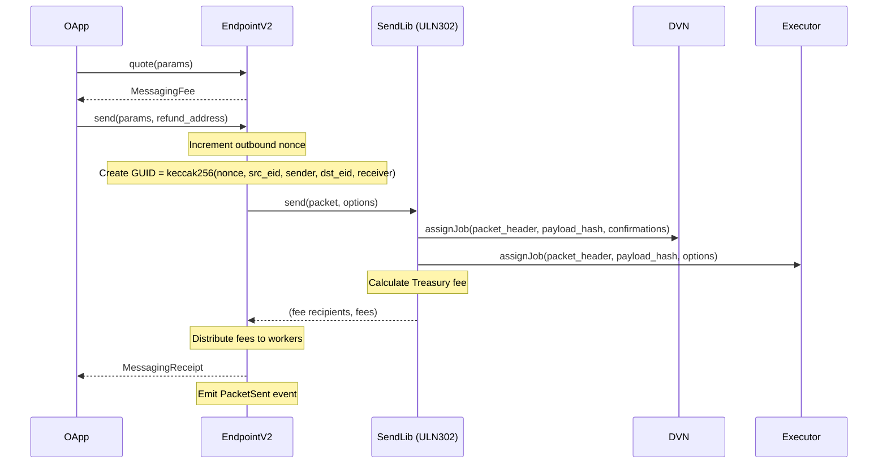
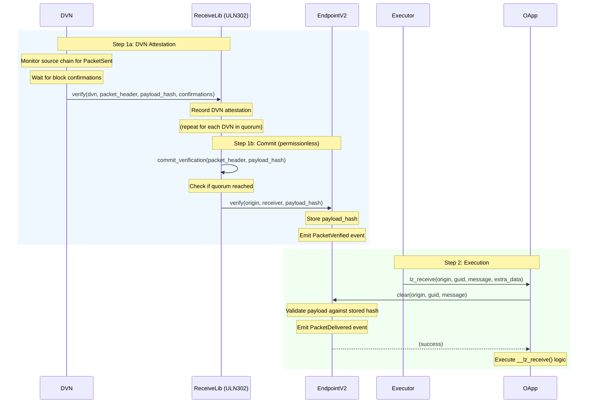

# LayerZero V2 on Stellar

This document provides a comprehensive guide to LayerZero V2's implementation on
the Stellar blockchain using Soroban smart contracts.

## Overview

LayerZero V2 on Stellar enables cross-chain messaging between Stellar and other
blockchains. Built on Soroban (Stellar's smart contract platform) using Rust, it
follows a modular, plugin-based architecture that maintains compatibility with
LayerZero's V2 protocol design while adapting to Stellar's unique
characteristics.

### Key components

- **EndpointV2**: Central hub for all cross-chain messaging operations
- **Message libraries**: Pluggable verification logic (ULN302, SimpleMessageLib)
- **Workers**: DVNs (Decentralized Verifier Networks) and executors
- **OApps**: Omnichain applications that leverage the protocol
- **OFT**: Omnichain Fungible Token standard for cross-chain token transfers

## Architecture

```
┌─────────────────────────────────────────────────────────────────────────────┐
│                              OApp / OFT                                     │
│                    (Omnichain Application Layer)                            │
└─────────────────────────────────────────────────────────────────────────────┘
┌─────────────────────────────────────────────────────────────────────────────┐
│                             EndpointV2                                      │
│                      (Central Messaging Hub)                                │
│  ┌─────────────────┐  ┌──────────────────┐  ┌────────────────────────────┐  │
│  │ MessageLib      │  │ MessagingChannel │  │ MessagingComposer          │  │
│  │ Manager         │  │ (Nonce/Payload)  │  │ (Multi-stage Execution)    │  │
│  └─────────────────┘  └──────────────────┘  └────────────────────────────┘  │
└─────────────────────────────────────────────────────────────────────────────┘
┌─────────────────────────────────────────────────────────────────────────────┐
│                         Message Libraries                                   │
│  ┌──────────────────────────────────┐  ┌─────────────────────────────────┐  │
│  │           ULN302                 │  │      SimpleMessageLib           │  │
│  │  (Ultra Light Node - Production) │  │      (Testing/Basic)            │  │
│  └──────────────────────────────────┘  └─────────────────────────────────┘  │
└─────────────────────────────────────────────────────────────────────────────┘
┌─────────────────────────────────────────────────────────────────────────────┐
│                              Workers                                        │
│  ┌────────────────────────────┐      ┌────────────────────────────────────┐ │
│  │           DVN              │      │           Executor                 │ │
│  │  (Message Verification)    │      │    (Message Execution)             │ │
│  └────────────────────────────┘      └────────────────────────────────────┘ │
└─────────────────────────────────────────────────────────────────────────────┘
```

## Core contracts

### EndpointV2

The central contract managing all cross-chain messaging operations.

**Location**: `contracts/endpoint-v2/`

**Key responsibilities**:

- Quote messaging fees
- Send cross-chain messages
- Verify inbound messages
- Clear and deliver verified messages
- Manage message libraries
- Track nonce ordering for message sequencing

**Internal modules**:

| Module                   | Purpose                                                                                                  |
| ------------------------ | -------------------------------------------------------------------------------------------------------- |
| `message_lib_manager.rs` | Library registration, selection, and configuration. Tracks default/per-OApp libraries per EID.           |
| `messaging_channel.rs`   | Nonce tracking, payload hash storage/verification, message state transitions (verify → receive → clear). |
| `messaging_composer.rs`  | Manages compose message queues for multi-stage execution between OApp and Composers.                     |
| `util.rs`                | Public utilities: `compute_guid()`, `build_payload()`, `keccak256()` for message processing.             |

**Design patterns**:

- **Interfaces as library exports**: External contracts depend on trait
  definitions only, controlled by the `library` feature flag
- **Interface composition**: `ILayerZeroEndpointV2` composes
  `IMessageLibManager`, `IMessagingChannel`, and `IMessagingComposer`
- **Client generation**: `#[contractclient]` macro generates type-safe client
  wrappers for cross-contract calls

### ULN302 (Ultra Light Node)

The primary message library implementing verification through DVNs and execution
through executors.

**Location**: `contracts/message-libs/uln-302/`

### DVN (Decentralized Verifier Network)

Provides cryptographic attestations that messages were properly sent on the
source chain.

**Location**: `contracts/workers/dvn/`

**Features**:

- Multisig-based verification using secp256k1 signatures
- Custom Soroban account interface for transaction signing
- Destination-specific configuration
- Fee calculation based on quorum size and gas costs

### Executor

Executes verified messages on the destination chain.

**Location**: `contracts/workers/executor/`

**Features**:

- Message delivery to receiving OApps
- Native token drops to addresses
- Destination-specific configuration
- Fee calculation based on message size and execution parameters

### OApp (Omnichain Application)

Base framework for building cross-chain applications.

**Location**: `contracts/oapps/oapp/`

**Key traits**:

| Trait                | Purpose                                           |
| -------------------- | ------------------------------------------------- |
| `OAppCore`           | Foundation: peer management, endpoint reference   |
| `OAppSenderInternal` | Internal helper for sending cross-chain messages  |
| `OAppReceiver`       | Public receiver interface, payload clearing       |
| `LzReceiveInternal`  | Application message handling (**must implement**) |
| `OAppOptionsType3`   | Enforced execution options management             |

### OFT (Omnichain Fungible Token)

Standardized cross-chain token bridge implementation.

**Location**: `contracts/oapps/oft-core/` (core traits) and `contracts/oapps/oft/`
(token types and extensions)

**Key traits**:

| Trait         | Purpose                                               |
| ------------- | ----------------------------------------------------- |
| `OFTCore`     | Public interface: `send()`, `quote_send()`, `token()` |
| `OFTInternal` | Internal implementation: `__debit()`, `__credit()`    |

**Features**:

- Token type flexibility (LockUnlock or MintBurn)
- Fee extension for outbound transfers
- Pausable extension
- Rate limiter extension
- Dust removal and slippage protection

## Messaging flow

### Sending a message



### Receiving a message



## Stellar-specific considerations

Several differences between Soroban and EVM require protocol-level adaptations:

1. Stellar's variable-length address model differs from LayerZero's fixed
   bytes32 address abstraction
2. Soroban's Time-To-Live (TTL)-based storage model requires active state
   maintenance, unlike EVM's persistent storage
3. Soroban's 200-read-per-transaction storage limit makes the lazy inbound
   nonce model susceptible to denial-of-service for certain OApps
4. Soroban prohibits reentrancy, requiring alternative patterns for cross-contract
   call flows

### Constraint 1: bytes32 address format mismatch

LayerZero V2 standardizes all cross-chain addresses using bytes32. Stellar uses
StrKey-encoded addresses of different types:

| Address Type | Structure                                              | Usage                    |
| ------------ | ------------------------------------------------------ | ------------------------ |
| G-Address    | 1-byte version + 32-byte public key + 2-byte checksum  | EOAs (Ed25519 key pairs) |
| C-Address    | 1-byte version + 32-byte contract ID + 2-byte checksum | Soroban smart contracts  |
| M-Address    | G-address payload + 64-bit ID (exceeds 32 bytes)       | Exchange sub-accounts    |

**Key observation**: G-Address and C-Address share the same 32-byte payload
structure, and the payload alone is guaranteed to be unique across both types.

**Solution: Deterministic address resolution**

All bytes32-encoded addresses are resolved at execution time:

1. **OApp & Composer addresses**: The bytes32 value is interpreted directly as a
   Soroban contract ID and converted to a C-address.

2. **Native drop & OFT receiver addresses**: Contract-first detection is
   applied:
    - Convert the bytes32 payload to a C-address
    - If a contract exists at that address, treat as C-address
    - Otherwise, treat as G-address

This resolution is deterministic and safe. Soroban guarantees that a deployed
contract address cannot correspond to a valid G-address private key, eliminating
ambiguity.

### Constraint 2: TTL-based storage model

All contract data entries on Soroban have a TTL. When TTL expires, data becomes
archived and inaccessible (but always restorable).

**Challenges**:

- **Cost impact**: The Endpoint contract (~60 KB) costs ~3.0 USD/month to keep
  alive. Restoration after archival (~4 months bump) costs ~12 USD.
- **Execution variability**: TTL extension during `lzReceive` introduces
  additional fees and risk of out-of-gas failures.
- **OApp-induced operations**: OApps (e.g., SAC tokens) may perform their own
  TTL bumps, adding unpredictable overhead.

**Solution: Hybrid TTL extension strategy**

LayerZero adopts a hybrid approach combining Self-Extension with Client
Extension:

1. **Self-Extension (default)**: Contracts automatically extend TTL for storage
   entries when accessed if remaining TTL falls below a configured threshold.
   This is autonomous and requires no external maintenance.

2. **Client Extension (selective)**: For low-activity periods, off-chain
   services or sealer-assisted extension can keep critical components (Endpoint,
   ULN) alive without imposing costs on users.

**Configurable TTL parameters**: Unlike typical Soroban apps that hardcode TTL
values, LayerZero exposes TTL thresholds and extension targets as configurable
values. This follows Stellar team recommendations, as storage fees and network
constraints may evolve.

**Governance safeguards**:

- Hard upper cap on extension targets (e.g., 1 year) to prevent excessive fees
- TTL parameters can be permanently frozen once the ecosystem stabilizes

### Constraint 3: Storage read limits

Soroban enforces a hard limit of 200 persistent/temporary storage reads per
transaction. Under the lazy inbound nonce model used in EVM, the `inbound_nonce`
is not stored directly — it is computed on the fly by iterating forward from the
last checkpoint (`lazy_inbound_nonce`) and probing storage for each consecutive
payload hash. The same iterative check occurs during `clear`, which must verify
that all nonces between the checkpoint and the target nonce have been verified.

For certain OApps, failed `lz_receive` executions can create nonce gaps that
grow over time. Under the lazy model, clearing subsequent messages requires
iterating across these gaps, and the accumulated storage reads can exceed the
200-read limit, making the messaging path susceptible to denial-of-service.

**Solution: Eager inbound nonce with pending nonce list (Solana model)**

Stellar adopts the same inbound nonce model used by LayerZero V2 on Solana.
Instead of lazily computing the inbound nonce via storage probing, the
`inbound_nonce` is stored directly and updated eagerly during verification:

1. **`PendingInboundNonces`**: A sorted list of out-of-order verified nonces is
   maintained in a single storage entry per path. When a message is verified
   (or skipped/nilified), its nonce is inserted into this list.

2. **Drain on insert**: After each insertion, consecutive nonces at the front of
   the list are drained to advance the `inbound_nonce`. For example, if
   `inbound_nonce = 3` and the pending list becomes `[4, 5, 7]`, nonces 4 and 5
   are drained, advancing `inbound_nonce` to 5.

3. **O(1) clear**: The `clear_payload` operation becomes a simple comparison
   (`nonce <= inbound_nonce`) with no iteration or storage probing.

4. **Bounded list size**: The pending list is capped at 256 entries
   (`PENDING_INBOUND_NONCE_MAX_LEN`). Nonces beyond `inbound_nonce + 256`
   cannot be verified, preventing unbounded memory growth and limiting the
   maximum storage reads per verify operation.

This eliminates the iterative storage reads that could cause DoS under the lazy
model, keeping all operations within Soroban's transaction resource limits.

### Constraint 4: Reentrancy prohibition

Soroban prohibits reentrancy—a contract cannot call itself, directly or
indirectly, within the same transaction. This fundamental difference from EVM
requires rethinking several LayerZero patterns.

#### Impact on DVN design

On EVM, the DVN contract uses a **self-call pattern** for multisig-authorized
self-configuration (e.g., setting destination configs, updating signers). An
admin submits M-of-N signatures over a set of calls to the DVN. The DVN verifies
the signatures, then calls itself to execute the configuration changes. For
external calls like `ULN302.verify()`, the DVN simply calls the target contract
directly after signature verification.

```
EVM DVN Flow (self-configuration):
┌─────────────┐    ┌─────────────┐    ┌─────────────┐
│    Admin    │───►│     DVN     │───►│     DVN     │  (self-call after
│             │    │  (verify)   │    │  (execute)  │   sig verification)
└─────────────┘    └─────────────┘    └─────────────┘

EVM DVN Flow (external calls):
┌─────────────┐    ┌─────────────┐    ┌─────────────┐
│    Admin    │───►│     DVN     │───►│   ULN302    │  (direct call after
│             │    │  (verify)   │    │  .verify()  │   sig verification)
└─────────────┘    └─────────────┘    └─────────────┘
```

The self-call pattern for configuration fails on Soroban because the DVN cannot
call itself. The solution is to implement DVN as an **Abstract Account** (custom
account). Soroban's custom account interface allows contracts to define
authorization logic via `__check_auth`. The DVN's `__check_auth` only authorizes
**self-calls** (calls targeting the DVN contract itself). For self-configuration,
the multisig quorum directly authorizes calls to the DVN's own functions (e.g.,
`set_admin`, `set_signer`). For external calls like `ULN302.verify()`, the DVN
exposes an `execute_transaction(calls)` function that is itself a self-call
validated by `__check_auth`, then dispatches each call to the target contract:

```
Stellar DVN Flow (self-configuration via Abstract Account):
┌─────────────┐    ┌─────────────┐
│    Admin    │───►│     DVN     │  __check_auth validates multisig
│  (submits   │    │ .set_admin()│  for the self-call
│   tx with   │    │             │
│   DVN auth) │    │             │
└─────────────┘    └─────────────┘

Stellar DVN Flow (external calls via execute_transaction):
┌─────────────┐    ┌─────────────┐    ┌─────────────┐
│    Admin    │───►│     DVN     │───►│   ULN302    │
│  (submits   │    │  .execute_  │    │  .verify()  │
│   tx with   │    │  transaction│    │             │
│   DVN auth) │    │ (__check_   │    │             │
│             │    │  auth)      │    │             │
└─────────────┘    └─────────────┘    └─────────────┘
```

The DVN's `__check_auth` validates:

- Verifier ID (VID) matches
- Authorization hasn't expired
- Admin signature is valid (Ed25519) — except for `set_admin` calls
- Call data hash hasn't been replayed
- M-of-N secp256k1 signatures from the quorum

#### Impact on executor design

LayerZero supports a common cross-chain pattern called **ABA messaging**—an
OApp on chain B receives a message from chain A and atomically sends a response
back to chain A within the same transaction:

```
ABA Pattern:
Chain A                    Chain B
┌───────┐                  ┌───────┐
│ OApp  │ ──── msg1 ─────► │ OApp  │
│       │ ◄─── msg2 ─────  │       │  (msg2 sent in lz_receive handler)
└───────┘                  └───────┘
```

If the executor were a regular contract that calls the OApp, it would be locked
during the receive flow. When the OApp attempts to send a message back (which
requires interacting with the executor for fee quoting), the transaction would
fail due to reentrancy:

```
❌ Regular Contract Executor (fails ABA):
┌──────────┐    ┌───────┐    ┌──────────┐    ┌─────────────┐
│ Executor │───►│ OApp  │───►│ Endpoint │───►│  Executor   │  BLOCKED!
│  .call() │    │       │    │  .send() │    │.assign_job()|  (reentrancy)
└──────────┘    └───────┘    └──────────┘    └─────────────┘
```

By implementing executor as an **Abstract Account**, the executor doesn't
"call" the OApp—it authorizes the OApp's `lz_receive` invocation. The executor
contract remains accessible for the send flow:

```
✓ Abstract Account Executor (supports ABA):
┌───────┐                                        ┌──────────┐
│ OApp  │ ◄───────── executor auth ────────────  │ Executor │  (not in call stack,
│       │            via __check_auth            │    AA    │   remains accessible)
│       │ ─► Endpoint.send() ─► .assign_job() ─► │          │  ✓ Works!
└───────┘                                        └──────────┘
```

#### Impact on message delivery design

The same reentrancy constraint affects how messages are delivered to OApps.

**EVM approach (push mode)**: The endpoint is the entry point. After verifying
and clearing the payload, the endpoint calls the OApp's `lzReceive`:

```
EVM Push Mode:
Executor ──► Endpoint.lzReceive() ──► OApp.lzReceive()
                    │
                    └── (clear payload, then call OApp)
```

This fails on Soroban for ABA messaging. If the endpoint calls the OApp, the
endpoint is locked. When the OApp tries to send a response message, it cannot
call back into the endpoint:

```
❌ Push Mode on Stellar (fails ABA):
Executor ──► Endpoint.lz_receive() ──► OApp ──► Endpoint.send()  BLOCKED!
                                               (reentrancy)
```

**Stellar approach (pull mode)**: The OApp is the entry point. The executor
authorizes the OApp's `lz_receive` call, and the OApp pulls verification from
the endpoint by calling `clear`:

```
✓ Pull Mode on Stellar (supports ABA):
Executor auth ──► OApp.lz_receive() ──► Endpoint.clear()
                         │
                         └──► Endpoint.send()  ✓ Works!
                              (endpoint not in call stack)
```

**Summary of reentrancy adaptations**:

| Component | EVM Pattern                      | Stellar Pattern                      | Reason              |
| --------- | -------------------------------- | ------------------------------------ | ------------------- |
| DVN       | Self-call after sig verification | Abstract Account with `__check_auth` | Cannot self-call    |
| Executor  | Regular contract calls OApp      | Abstract Account authorizes OApp     | ABA pattern support |
| Delivery  | Push (Endpoint → OApp)           | Pull (OApp → Endpoint.clear)         | ABA pattern support |

## Building OApps and OFTs

- [oapp-guide.md](oapp-guide.md) - Building Omnichain Applications using the
  OApp framework, macros, and traits
- [oft-guide.md](oft-guide.md) - Building Omnichain Fungible Tokens with
  MintBurn/LockUnlock strategies and extensions

## Error codes

See [error-spec.md](error-spec.md) for the error code allocation strategy and
detailed specifications.
